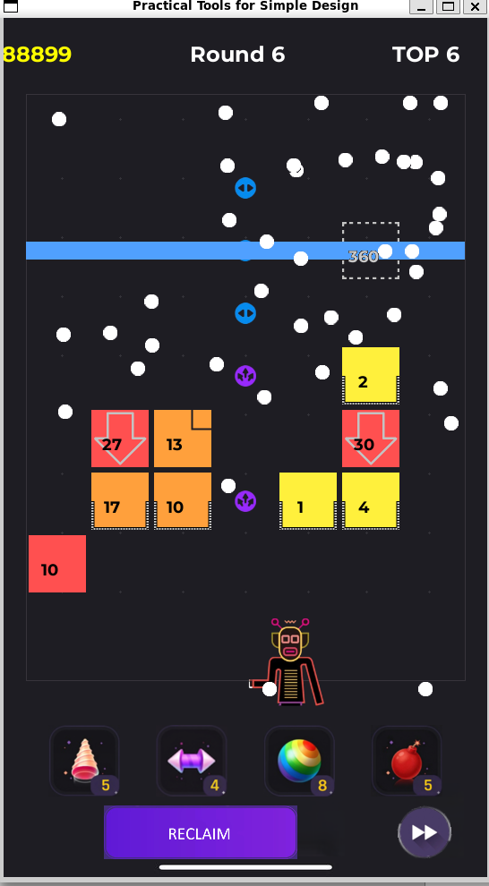
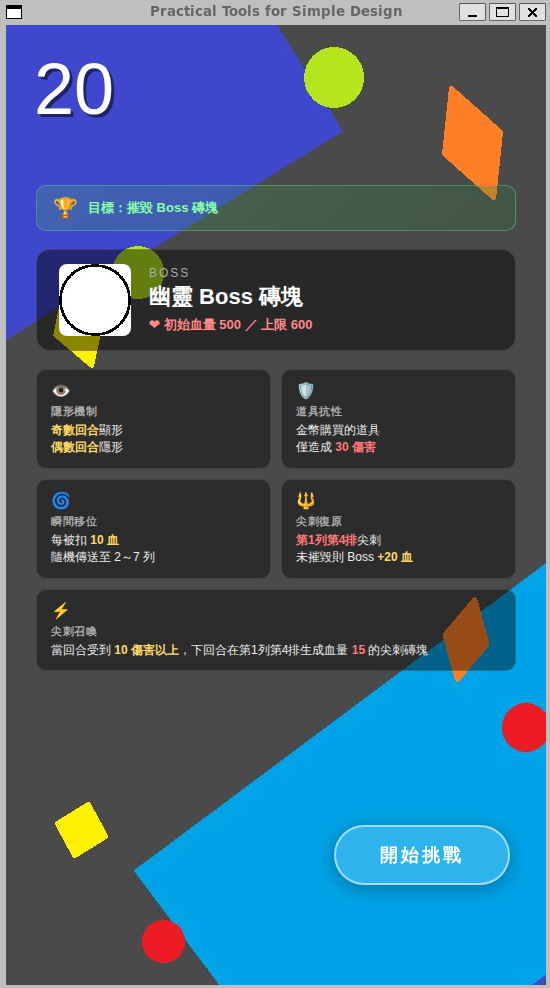
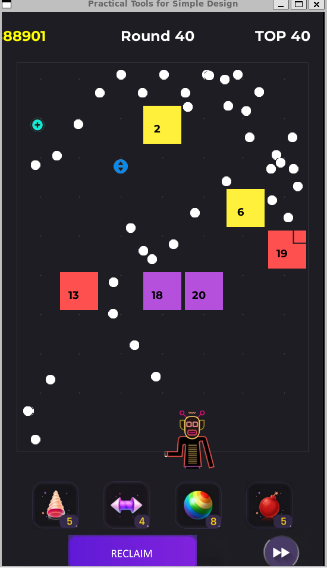
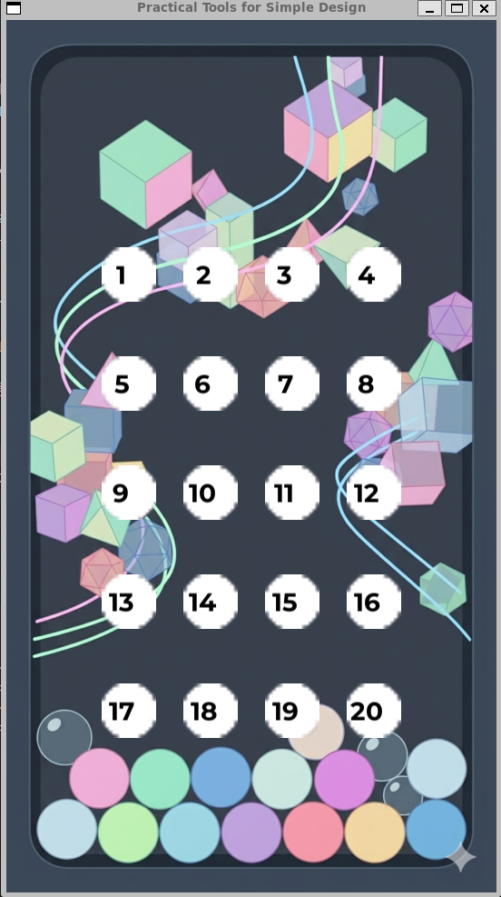
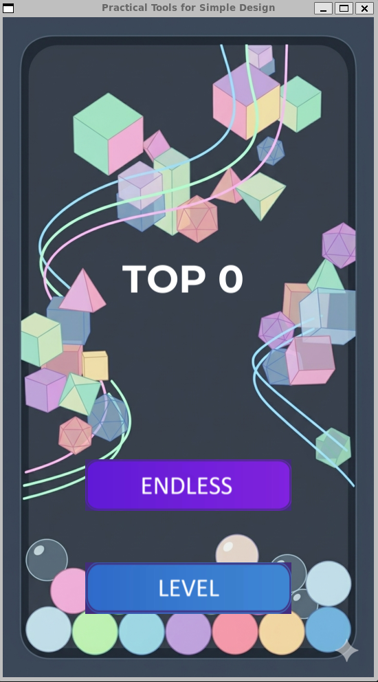
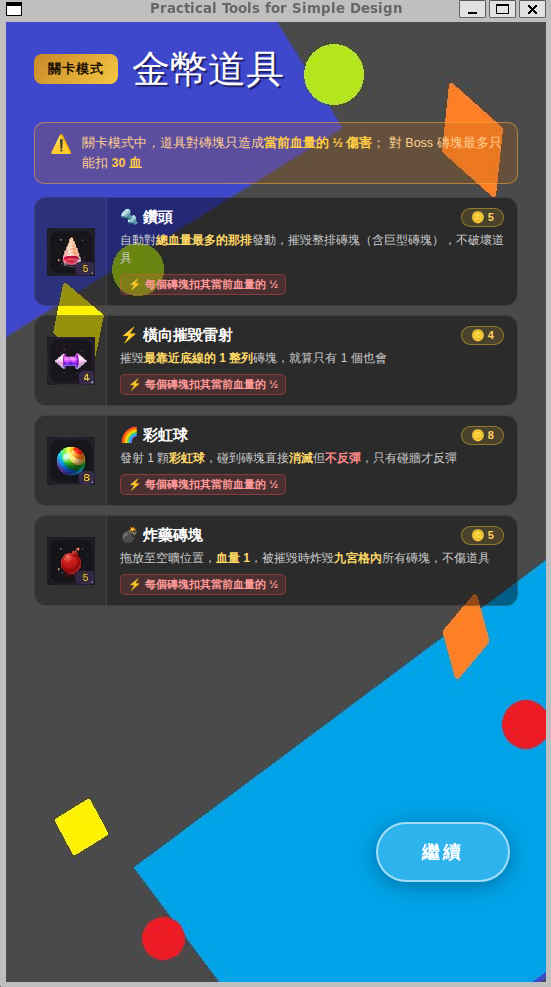

# 2026 OOPL Final Report

## 組別資訊

組別：34

組員：112820031 華承浩 112820040 張哲瑋

復刻遊戲：**BBTAN**

## 專案簡介

### 遊戲簡介

BBTAN 是一款於 2015 年由 111% 推出的休閒益智彈球遊戲。玩家在畫面下方控制發射方向，將一群球以同一角度依序彈射出去，擊打畫面上方逐回合下移的方塊。每個方塊上標示的數字代表剩餘血量，球每碰到一次扣 1 滴血，血量歸零方塊消失。每回合結束後磚塊整體下移一格，若任何方塊觸及底線則遊戲結束。隨著回合推進，玩家可以累積球數、撿取道具，並挑戰更高分。

本專案以 BBTAN 為基礎完整復刻，並在原作上額外擴充：

- **無限模式**：對應原版的核心玩法，磚塊隨機生成、無止盡挑戰最高分
- **關卡模式**：自行設計 20 個關卡（含 3 個 Boss 關），每關有獨立的磚塊配置、結束條件與挑戰主題
- **道具系統**：包括撿取式道具（橫向 / 直向雷射、+1 球、TNT、散射）與金幣購買的道具（鑽頭、橫向摧毀雷射、彩虹球、TNT）
- **多種特殊磚塊**：分裂、連鎖、隱形、防護罩、尖刺、厚底、下墜、高密度、巨大、三角形、鎖頭 / 鑰匙等共十餘種
- **三個 Boss**：每個 Boss 各有獨特機制（傳送、額外召喚磚塊、奇偶顯隱、自殘回血等）

### 組別分工

有許多部分是兩人協力完成，難以具體描述各自負責了哪些內容，不過大概如下：
| 組員 | 大致上的分工內容 |
|------|----------------|
| 華承浩 | 物理碰撞、反彈邏輯、關卡設計、素材手繪、特效 |
| 張哲瑋 | 素材生成、道具構想、部分磚塊設計、發射器程式碼 |

## 遊戲介紹

### 遊戲規則

**基本操作**

- 編譯到開啟遊戲(透過WSL:Ubuntu)：bash → mkdir build → cd build → cmake --build . → ./BBTAN
- 滑鼠拖曳：瞄準發射方向
- 滑鼠放開：依目前方向以固定速度連續發射所有球
- ESC：返回上一層畫面（無限 / 選關 → 主畫面；關卡 → 選關畫面）

**遊戲流程**

1. 從主畫面選擇「無限模式」或「關卡模式」
2. 進入遊戲後，每回合玩家發射所有球，球碰到磚塊扣血、碰到牆面反彈
3. 所有球落地後該回合結束，磚塊下移一列、頂端生成新一列磚塊
4. 玩家在此期間可以使用回收（瞬間吸回所有球到下一發射點）、加速（球速三倍）與金幣購買的道具
5. 若任何磚塊接觸底線即 Game Over；無限模式記錄最高回合數，關卡模式則依關卡條件判定通關

**模式與結束條件**

| 模式 | 結束條件 | 失敗條件 |
|------|----------|----------|
| 無限模式 | 無 | 磚塊觸底 |
| 關卡 1-9, 11-14, 16-19 | 該關回合數 + 場上磚塊清空 | 磚塊觸底 |
| 關卡 10, 15, 20 | 擊敗該關 Boss | 磚塊觸底（關卡 15 額外有「連續 6 回合未摧毀尖刺即失敗」） |

**磚塊種類概覽**

| 磚塊 | 機制 |
|------|------|
| 普通方塊 | 標準磚塊，HP = 當下回合數 |
| 高密度 | HP 為普通方塊兩倍 |
| 連鎖 | 場上所有連鎖磚塊共用血量池，扣血同步 |
| 分裂 | 死亡時分裂為 2 個血量減半的普通方塊 |
| 隱形 | 偶數列顯形、奇數列隱形；隱形時普通球穿透不扣血 |
| 防護罩 | 普通球攻擊不扣血，金幣道具可破，被擊中後當回合結束破罩變普通方塊 |
| 尖刺 | 球碰到後本回合休假，下回合復活 |
| 厚底 | 從下方擊中不扣血（只反彈），其他方向正常 |
| 下墜 | 每回合除一般下移外，再額外下落一格 |
| 巨大 | 2×2 的大型磚塊，佔 4 個格位 |
| 三角形 | 直角區域反彈、斜面 45 度反射 |
| 鎖頭 / 鑰匙 | 鎖頭不受普通球傷害，鑰匙觸發後同回合所有鎖頭解鎖 |
| TNT | 被擊中或被波及時，BFS 範圍內所有磚塊一同扣血 |

**道具系統**

撿取式（場上磚塊，球碰到生效）：

- +1 道具：累積一顆新球至下回合
- 橫向雷射：摧毀同列所有磚塊
- 直向雷射：摧毀同排所有磚塊
- TNT：BFS 連鎖爆破
- 散射：球碰到後分裂成多顆球
- 金幣：撿取後累積金錢，用於購買金幣道具

金幣道具（消費金錢使用）：

- 鑽頭（5 金幣）：找血量總和最高的一直排扣血（關卡模式扣當下血量一半、無限模式秒殺）
- 橫向摧毀雷射（4 金幣）：同理但對最高一橫列
- 彩虹球（8 金幣）：發射一顆穿透扣血的彩虹球
- TNT（5 金幣）：拖曳放置位置觸發爆炸

**Boss 機制**

| 關卡 | Boss HP | 傳送觸發 | 特殊機制 |
|------|---------|---------|----------|
| Level 10 | 150 | 每扣 10 滴血 | 傳送後在場上 spawn 4 個 HP=20 分裂磚塊 |
| Level 15 | 300 | 每扣 15 滴血 | 傳送後 spawn 2 個 HP=15 尖刺；每回合 Boss 在場時清除所有尖刺再生 2 個；連續 6 回合未摧毀尖刺則失敗 |
| Level 20 | 500（上限 600） | 每扣 10 滴血 | 第 1 回合即出現；奇數回合顯形、偶數回合隱形；單回合 Boss 扣血 ≥ 10 即在第一列第四排 spawn HP=15 尖刺；下回合若該尖刺未被消滅，自動清除且 Boss 回 20 血 |

所有 Boss 共通：金幣道具單次傷害上限 30、開局 40 球（僅 Level 20）。

### 遊戲畫面

（於此處附上遊戲執行截圖：主畫面 / 選關 / 關卡介紹 / 道具介紹 / 無限模式進行中 / 關卡 Boss 戰）
     

## 程式設計

### 程式架構

本專案以 PTSD（Practical Tools for Simple Design，課程提供的 SDL2 + OpenGL 封裝框架）為基礎，採物件導向 C++ 撰寫。專案結構分為四大邏輯層：
(以下是較為重要的幾個檔案，重要性較低的檔案則不另外提及)

```
BBTAN/
├── PTSD/                       # 課程框架（Util::GameObject、Util::Image 等）
├── Resources/
│   ├── Image/                  # 磚塊、球、UI、特效、Boss、介紹畫面
│   └── Font/                   # 中英文字型
├── include/
│   ├── App.hpp                 # 主程式邏輯
│   ├── Ball.hpp                # 球物件
│   ├── Brick.hpp               # 磚塊物件（含 enum BrickType 共 22 種）
│   ├── LevelManager.hpp        # 關卡與磚塊生成
│   ├── EffectLine.hpp          # 雷射特效物件
│   └── DeathEffect.hpp         # 死亡特效物件
└── src/
    ├── AppInit.cpp             # 啟動初始化
    ├── AppUpdate.cpp           # 主迴圈（物理 / 碰撞 / 狀態機）
    ├── AppUtil.cpp             # 共用 helper
    ├── Brick.cpp               # 各磚塊行為實作
    ├── LevelManager.cpp        # 20 關 spawn 邏輯與道具實作
    ├── EffectLine.cpp
    └── DeathEffect.cpp
```

**核心類別關係**

- `App` 持有 `LevelManager`、`m_Root`（PTSD 場景根節點）、各種 UI 物件、球與特效容器
- `LevelManager` 管理場上所有磚塊（`std::vector<std::shared_ptr<Brick>>`），負責每回合 spawn、下移、Boss 行為、金幣道具效果
- `Brick` 是統一的磚塊類別，以 `BrickType` enum 區分行為；不同型別在 `OnHit`、`OnRoundEnd`、`UpdateColor` 等方法分支處理
- `App::Update()` 用狀態機切換主畫面、選關、介紹畫面、無限模式、關卡模式、Game Over 等狀態

**遊戲狀態**

```
MAIN_MENU ─┬─→ GAMEPLAY_ENDLESS (含 PROPS_INTRO 首次顯示)
           └─→ BALL_SELECTION  ─┬─→ LEVEL_INTRO (Lv 2-10, 15, 20)
                                └─→ GAMEPLAY_LEVEL (含 PROPS_INTRO 首次顯示)
                                      ├─→ GAME_OVER
                                      └─→ BALL_SELECTION (通關 / 失敗 / ESC)
```

### 程式技術

**1. AABB 碰撞與分離軸**

球與磚塊的碰撞採 AABB（軸對齊包圍盒）。`ResolveCollision` 在偵測到重疊後，比較 X、Y 軸的穿透深度，取較小者作為反彈軸，並把球外推回磚塊邊界以避免「卡進磚塊內」。

三角形磚塊額外計算「球中心到斜邊的距離」做為第三個軸（SAT 簡化版），只有當斜邊是最淺穿透面時才執行 45 度交換速度反彈，其他情況視為與該磚塊的水平 / 垂直邊碰撞。

```cpp
bool ResolveCollision(...) {
    float overlapX = (ballSize.x + brickSize.x)/2 - std::abs(dx);
    float overlapY = (ballSize.y + brickSize.y)/2 - std::abs(dy);
    if (overlapX <= 0 || overlapY <= 0) return false;

    if (type == TRIANGLE) {
        float dist = ...;  // 到斜邊距離
        if (dist > R) return false;          // 球在空氣區
        float penSlant = R - dist;
        if (penSlant < overlapX && penSlant < overlapY) {
            // 45 度反彈
        } else if (overlapX < overlapY) { /* 側面 */ }
        else                            { /* 上下 */ }
    } else {
        if (overlapX < overlapY) { /* 側面 */ }
        else                     { /* 上下 */ }
    }
}
```

由於 SLOT_SIZE=70 但磚塊圖檔僅 64×64，相鄰磚塊間存在 6px 縫隙，會造成球從對角線高速穿越時「兩磚塊都只有微小重疊、ResolveCollision 互相抵消」的穿縫 bug。最終解法是將碰撞箱放大到 70×70（視覺仍 64×64），消除縫隙。

**2. 共用血量池：連鎖磚塊**

連鎖磚塊（LINKED）的所有實例共享同一血量池 `m_LinkedSharedHp`。每次磚塊生成時用 `AddLinkedHp(round)` 把該磚塊的初始 HP 加進池中、扣血時用 `DamageLinked(damage)` 從池中扣除並同步所有 LINKED 實例的顯示。為了讓血量顏色正確反映「池子當下 / 池子最大」的比例，加進池的同時也同步更新每個 LINKED 的 `m_MaxHp`。

**3. 分裂磚塊的子磚塊染色**

分裂磚塊（SPLIT）死亡時在隨機空位生成 2 個普通方塊，HP = parent.maxHp / 2。為了讓子磚塊滿血時呈現紫色（與普通方塊滿血同樣是 50% ratio），子磚塊建構子的 `round` 參數使用其自身的 newHp 而非當前回合數，使 `m_InitRound` 對應子磚塊的滿血量，染色公式 `ratio = hp / (m_InitRound × 2)` 自然落在 0.5。

**4. 隱形磚塊雙態切換**

隱形磚塊依列數判定顯隱（偶數列隱形、奇數列顯形）。透過 `RefreshInvisibleVisual()` 在每次下移後重設貼圖與血量數字顏色（隱形：灰字 + Invisible_Brick.png；顯形：黑字 + 染色方塊）。`IsInvisibleHidden()` 提供給碰撞系統判定球是否穿透。

**5. Boss 機制**

每個 Boss 都用獨立的 `BrickType` enum 值（LEVEL10_BOSS、LEVEL15_BOSS、LEVEL20_BOSS）。共用機制（金幣道具傷害上限 30、累積傷害觸發傳送）寫在 `Brick::OnHit` 內；獨有機制（傳送後 spawn 什麼、回合開始的特殊行為、顯隱切換）拆成 `LevelManager` 內的 `Level10TeleportBoss / Level15OnBossDamaged / Level20OnRoundStart` 等函式。

傳送 dispatch 透過動態 threshold 表完成：

```cpp
auto bossType = brick->GetType();
int threshold = 0;
if (bossType == LEVEL10_BOSS) threshold = 10;
else if (bossType == LEVEL15_BOSS) threshold = 15;
else if (bossType == LEVEL20_BOSS) threshold = 10;

if (threshold > 0 && !dead) {
    while (brick->m_DmgSinceTeleport >= threshold) {
        brick->m_DmgSinceTeleport -= threshold;
        // 分派到對應 Boss 的副作用函式
    }
}
```

**6. 磚塊染色系統**

由於 PTSD 框架的 `Util::Image` 沒有暴露 OpenGL 的紋理 tint API（SDL_SetTextureColorMod 在 PTSD 沒對應介面），透過 Python + Pillow 腳本一次預先生成各磚塊的 6 色版本（綠 / 藍 / 紫 / 紅 / 橘 / 黃），共 9 種磚塊 × 6 色 = 54 張貼圖。

`Brick::UpdateColor()` 依血量比例選擇對應顏色貼圖：

```cpp
ratio = m_Hp / (m_InitRound × 2);   // 普通磚塊滿血 = 0.5 → 紫
                                     // 高密度滿血  = 1.0 → 綠
const char* color = (ratio >= 0.85) ? "Green"  :
                    (ratio >= 0.65) ? "Blue"   :
                    (ratio >= 0.45) ? "Purple" :
                    (ratio >= 0.25) ? "Red"    :
                    (ratio >= 0.10) ? "Orange" : "Yellow";
SetDrawable(load("Normal_Brick_" + color + ".png"));
```

為避免每次 `SetHp` 都觸發 SetDrawable，類別內快取 `m_CurrentColorPath`，只有跨色階才實際換貼圖。

**7. 雷射特效**

由於 PTSD 也不支援紋理 alpha / scale 的動態變化，雷射特效用 `EffectLine` 類別管理：載入 8×8 純色 PNG，用 `m_Transform.scale` 拉伸成所需長度與粗度的線條。生命週期 0.35 秒由 `Tick(dt)` 自行倒數，App 主迴圈每幀遍歷 `m_LaserEffects` 推進並移除過期物件。

PTSD 不會自動 traverse 場景樹，所有要繪製的物件都必須在 `App::Update()` 對應狀態 case 內手動呼叫 `->Draw()`。特效的 z-order 介於磚塊（-3）與球（10）之間。

**8. 關卡資料**

20 關的磚塊配置寫死於 `SpawnLevel1Round` ~ `SpawnLevel20Round`，每函式內以 lambda 縮寫各種磚塊型別、再 switch case 對應每回合。循環關卡用 `round % N` 對應幾個 pattern，後段固定關卡逐 case 列出。

```cpp
auto SQ = [&](int c) { SpawnBrick(c, SQUARE, round, 0); };
auto LK = [&](int c) { SpawnBrick(c, LINKED, round, 0); };
auto T  = [&](int c, int o) { SpawnBrick(c, TRIANGLE, round, o); };
auto G  = [&](int c) { SpawnGiant(c, round); };

switch (round % 5) {
    case 1: HB(0); HB(1); CN(2); AB(3); G(5); break;
    case 2: AB(1); LK(2); LK(3); CN(4); break;       // GIANT 上半，不重 spawn
    ...
}
```

**9. 介紹畫面狀態**

關卡 2-10、15、20 各有一張 `level0X_intro.png` 介紹該關新出現的磚塊或機制；無限模式與關卡 1 首次進入時顯示道具介紹 `props_infinite_mode.png` / `props_level_mode.png`。介紹畫面用獨立的 `LEVEL_INTRO` 與 `PROPS_INTRO` 狀態管理，按右下角「開始挑戰」按鈕進入遊戲、ESC 退回上一層。

### 使用到 AI/AI Agent 的部分

本專案在大量實作上有借助 Claude 、 Gemini 協助。主要使用方式為：

- **架構討論與設計**：例如 Boss 機制如何拆分共用與獨有邏輯、磚塊型別 enum 設計、狀態機切換流程
- **關卡資料轉譯**：將 docx 設計表格翻譯成對應的 `SpawnLevelXRound` C++ 函式（包含 GIANT 的雙回合上下半判讀、三角形方向對應、循環模式辨識）
- **Bug 診斷**：碰撞箱穿縫、隱形磚塊染色衝突、Boss 下移卻不該觸發 Game Over、連鎖磚塊池與顯示比例不一致等具體 bug 的根因分析
- **PTSD 框架限制的迴避方案**：原本希望用 `SetColor` 對磚塊 tint，因 PTSD 未暴露對應 API，改採預生成多色貼圖方案；雷射特效改用 scale 拉伸點陣圖達成
- **Python 工具腳本**：批次生成各磚塊的 6 色版本 PNG

所有 AI 給出的程式碼皆經組員實際整合、調整以契合既有專案結構，並逐項驗證行為正確；部分建議在貼合實際 codebase 時需要重寫（例如 PTSD API 名稱與實際不符的情況）。

## 結語

### 問題與解決方法

**問題 1：磚塊染色 — PTSD 不支援紋理 tint**

PTSD 的 `Util::Image` 沒有 `SetColor` 也沒有 `SetTint`，OpenGL 紋理染色需要修改框架本身或寫 shader。最終採取「預先生成多色貼圖 + 依血量切換 drawable」方案，雖然顏色階段較少（6 階），但完全不依賴框架修改、所有磚塊皆可染色。

**問題 2：球穿縫**

磚塊邊到邊有 6px 縫隙（SLOT_SIZE 70 - 圖檔 64），球從對角線高速穿越時 AABB 重疊量過小，ResolveCollision 處理多重碰撞時兩磚塊外推方向相反互相抵消。解法是將碰撞箱放大至 70×70（視覺仍 64×64），消除縫隙。對 GIANT、道具不影響。

**問題 3：分裂磚塊子代染色錯誤**

子代磚塊原本傳 `round=1` 給建構子，導致 `m_InitRound=1` 使 referenceMax 過小、ratio 永遠超過 1 → 永遠綠色。解法是改傳 `round=newHp`，讓子磚塊的「滿血量」與染色基準一致，符合「滿血時與普通磚塊一樣的紫色」設計。

**問題 4：連鎖磚塊顏色不更新**

連鎖磚塊建構子時 UpdateColor 用個別 HP（10）算 ratio = 0.5 → 紫；之後 LevelManager 同步全部磚塊 HP 為池子總和（50）但沒重新觸發 UpdateColor，導致顏色卡在初始紫色。解法是讓 `SetHp` 內部自動呼叫 `UpdateColor`，並讓池子改變時同步更新每個磚塊的 `m_MaxHp`。

**問題 5：Boss 自動下移會誤觸發 Game Over**

Boss 與普通磚塊一樣下移；若 Boss 跑到死亡線下方原本會觸發 Game Over。實際上 Boss 跑到下方是「玩家放任太久」的後果而非失敗條件本身，因此將 Boss 排除於死亡判定迴圈，讓玩家用金幣道具強制傳送把 Boss 拉回場上。Level 20 中的 Boss SPIKE 固定在第一列第四排不下移，透過 `m_IsBossSpike` flag 標記區分。

**問題 6：特效寫進場景樹但不顯示**

EffectLine 加入 `m_Root` 卻完全不渲染。追查發現 PTSD 不自動 traverse 場景樹，所有 Draw 都是 App 手動呼叫；雷射特效未被加入手動繪製清單。解法是在 `App::Update()` 對應狀態 case 內，於磚塊 Draw 之後、球 Draw 之前手動遍歷 `m_LaserEffects` 呼叫 Draw。

### 自評

| 項次 | 項目                   | 完成 |
|------|------------------------|-------|
| 1    | 這是範例 |  V  |
| 2    | 完成專案權限改為 public |  V  |
| 3    | 具有 debug mode 的功能  |    |
| 4    | 解決專案上所有 Memory Leak 的問題  |  V  |
| 5    | 報告中沒有任何錯字，以及沒有任何一項遺漏  |  V  |
| 6    | 報告至少保持基本的美感，人類可讀  |  V  |

### 心得

112820031 華承浩：
在本次 BBTAN 遊戲開發專案中，我們深刻體會到將理論知識轉化為實際遊戲架構的挑戰性。這不僅僅是實作遊戲規則，更是對 C++ 物件導向程式設計（OOP）、記憶體生命週期以及渲染管線（Rendering Pipeline）的一次全面實戰。

開發過程中遇到最印象深刻的技術瓶頸在於物理碰撞引擎與記憶體管理的交錯問題，像是在處理巨大磚塊的邊緣碰撞時，原本球體會發生異常的「穿透並連續扣血」現象。經過反覆追蹤底層邏輯，才發現是 C++ 傳值（Pass by Value）與傳址（Pass by Reference, &）的細微差異，導致推擠防穿透的演算法只作用在局部變數上，而未更新真實物件。將架構改為讓物件自身透過 GetSize() 動態回報多型大小，並配合參照傳遞後，才完美解決了這個物理陷阱。

另外在處理 UI 顯示與狀態機（State Machine）切換的時候，我遇到了「幽靈渲染」的問題——UI 物件因為被掛載到錯誤的場景節點，在狀態重置時被系統底層直接清空，進而引發 Segmentation fault。這促使我重新梳理了 std::shared_ptr 的參照計數與 GameObject 的生命週期，將 UI 的生成改為懶漢式加載與狀態綁定，徹底確保了記憶體的安全。

這次專案讓我跳脫了單純的演算法思維，學會如何站在「系統引擎」的角度去考量程式碼的強健性與擴充性。看著自己親手打造的碰撞運算與渲染架構順利運作，是一件非常有成就感的事。

最後也感謝助教們每周的關心和一些技術上的指導。

112820040 張哲瑋：
開發復刻 BBTAN 專案，是一段充滿挑戰的過程。我們的目標不僅是把遊戲「做出來」，更希望能高度還原出原作那種「子彈連發、反彈與破壞」的打擊感。

在實作初期，光是讓球與磚塊產生正確的互動就花費了大量心力。為了支援多種不同的機關（如：雷射、散射、分裂、防護罩等），我們設計了一個統籌全域的 LevelManager，並運用物件導向的多型特性，讓每一種特殊磚塊都能擁有獨立的行為與視覺表現。為了讓遊戲更具挑戰性與變化，我們捨棄了單純的隨機生成，而是利用模數運算搭配陣列，設計了長達 40 回合的循環陣型演算法，讓玩家能感受到從「累積資源」到「面對高牆」的節奏變化。

開發中最讓我們頭痛，卻也收穫最多的部分是細節打磨。比方說：巨大磚塊的碰撞箱（Hitbox）與視覺大小不匹配導致的穿透感、不同圖檔素材（8-bit 與 32-bit）造成的底層渲染報錯，以及海量球體同時移動時的效能與卡牆問題。為此我們還加入了防卡牆的安全機制、重構了射擊角度的數學限制，並獨立繪製了專屬的碰撞體積。

這次的開發經驗讓我深刻認識到，一款好玩的遊戲背後，是無數個微小的數學公式與邊界條件組合而成的。能夠從零到有，把腦海中的設計圖變成螢幕上流暢運作的遊戲，讓我對未來的軟體開發充滿了熱忱與信心。

### 貢獻比例

| 組員 | 貢獻比例 |
|-----|----------|
| 華承浩 | 55% |
| 張哲瑋 | 45% |
